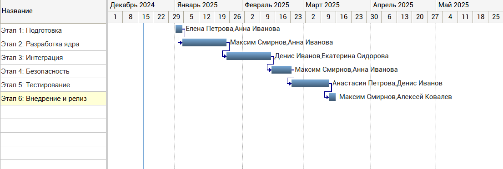
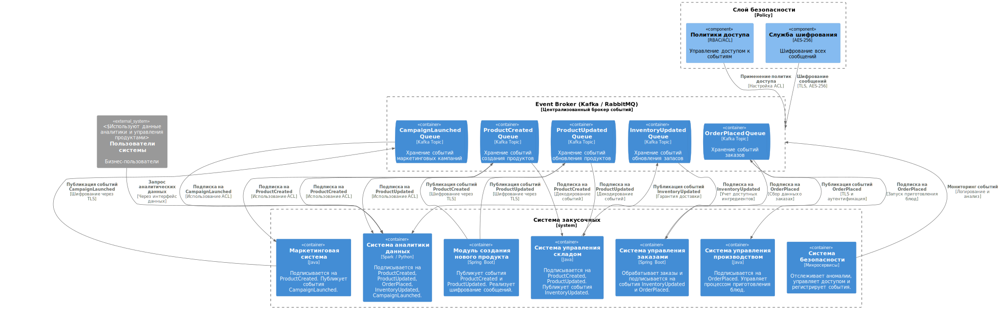

= Проект по разработке системы внедрения новых продуктов в сети столовых "Замысловатость"

== Общая информация
Ключевой задачей в рамках выполнения данной проектной работы является реализация механизмов упрощенного внедрения новых продуктов в сети межконтинентальных закусочных “Замысловатость”.
 

== Цели внедрения проекта

//Пример нумерованного списка:

.Цель 1:
Улучшение взаимодействия между модулями системы закусочных для обеспечения надежной и безопасной обработки данных, связанных с созданием и обновлением блюд.

.Цель 2
Оптимизация бизнес-процессов и повышение качества анализа данных путем интеграции новых событий и механизмов безопасности.

== Описание проекта

Ключевые задачи проекта:

. Разработка и внедрение модуля создания нового блюда (NewProductModule) с функциональностью публикации событий ProductCreated и ProductUpdated.
. Расширение системы управления складом (Inventory System) для обработки новых типов событий.
. Оптимизация работы брокера событий (Event Broker) для обеспечения высокой производительности и надежности передачи сообщений.
. Внедрение политик доступа (RBAC/ACL) и шифрования данных через Security System.
. Поддержка аналитических возможностей за счет обновления Data Analytics System для работы с новыми событиями.

Выбранная методология: Agile (Scrum).

Обоснование выбора:

. Постоянное взаимодействие с бизнесом и адаптация требований.
. Инкрементальная доставка функциональности.
. Возможность быстрого реагирования на изменения.

Управление проектом будет осуществляться в системе Jira:

Создание и управление задачами, связанными с реализацией модуля.

Отслеживание прогресса и статус выполнения.

Использование Confluence для документирования.

Ссылка на проект:https://zamysel.atlassian.net/jira/software/projects/ZMSL/boards/1/backlog

//формат для вставки гиперссылки link

== Roadmap проекта

== Команда проекта

.Команда проекта
[cols="2*",options="header"]  
|=== 
|Должность|Количество
|Руководитель проекта: |1
|Системный аналитик|1
|BE Разработчик|2
|FE Разработчик|1
|Тестировщик|1
|===

= Структура рисков для проекта сети закусочных

[cols="2,1,2,2", options="header"]
|===
| Риск | Вероятность | Последствия | Методы управления

| *Технические риски*
|
|
|

| 1.1 Ошибки в разработке модулей или интеграции
| Средняя
| Задержки в запуске системы, дополнительные расходы на доработки
| Регулярное тестирование (юнит-тесты, интеграционные тесты), контроль качества кода (code review)

| 1.2 Неправильная настройка брокера событий
| Средняя
| Потеря или задержка событий, сбои в коммуникации между системами
| Настройка кластеров Kafka, тестирование нагрузки, настройка Dead Letter Queue

| 1.3 Невозможность обработки пиковых нагрузок
| Низкая
| Задержка в обработке заказов, снижение производительности системы
| Горизонтальное масштабирование, нагрузочное тестирование

| 1.4 Уязвимости в безопасности системы
| Средняя
| Утечка данных, несанкционированный доступ, нарушение законодательства (GDPR)
| Внедрение RBAC, MFA, IDS/IPS, регулярное сканирование на уязвимости

| 1.5 Сложности при интеграции существующих систем с новым модулем
| Средняя
| Увеличение сроков реализации, конфликты данных, ошибки в обработке событий
| Постепенная интеграция через пилотные версии, тестирование совместимости API

| *Организационные риски*
|
|
|
| 2.1 Нехватка квалифицированного персонала
| Средняя
| Увеличение сроков реализации, дополнительные расходы на обучение или найм специалистов
| Проведение тренингов, привлечение внешних экспертов

| 2.2 Сопротивление сотрудников внедрению новой системы
| Низкая
| Снижение эффективности использования новой функциональности
| Обучение персонала, демонстрация пользы от новой системы

| *Риски поставки и инфраструктуры*
|
|
|

| 3.1 Задержка поставки или развертывания инфраструктуры
| Средняя
| Сдвиг сроков внедрения, увеличение бюджета
| Подготовка резервных мощностей, использование облачных решений

| 3.2 Сбой в работе облачных сервисов (AWS, Azure)
| Низкая
| Нарушение работы всех связанных модулей
| Использование нескольких зон доступности, настройка резервных систем

| *Риски управления проектом*
|
|
|

| 4.1 Недостаточная спецификация требований
| Средняя
| Доработки на поздних стадиях, увеличение сроков и бюджета
| Регулярные сессии уточнения требований, документирование изменений

| 4.2 Задержки на этапах утверждения решений
| Низкая
| Замедление работы команды, увеличение сроков проекта
| Оптимизация процессов согласования, назначение ответственных за принятие решений

| *Эксплуатационные риски*
|
|
|

| 5.1 Отказ системы в пиковое время (праздники, акции)
| Низкая
| Утрата доходов, ухудшение репутации компании
| Стресс-тестирование, настройка кэширования и масштабирования

| 5.2 Ошибки пользователей при работе с системой
| Средняя
| Снижение производительности, увеличение нагрузки на техническую поддержку
| Интуитивный интерфейс, обучение персонала, дашборды с мониторингом
|===

== Описание выбранного решения

Архитектура на основе событий (Event-Driven Architecture, EDA) хорошо подходит для интеграции различных модулей сети закусочных, особенно когда нужно реагировать на события в реальном времени, такие как создание нового продукта, размещение заказа, изменение состояния запасов или запуск маркетинговой кампании.

В EDA взаимодействие между системами осуществляется через события и сообщения, которые публикуются и подписываются другими компонентами, что делает архитектуру более гибкой и масштабируемой.

Компоненты и события в EDA-архитектуре
Event Broker (например, Kafka, RabbitMQ): центральный компонент для обмена сообщениями, который позволяет отправлять и получать события от различных систем.

== Описание архитектуры с НФТ

Объяснение элементов и их роли в архитектуре:

.Система управления производством (Production Management System):
Подписывается на OrderPlaced: получает новые заказы от Order Management System для обработки на кухне и передачи персоналу. Система управления производством должна быть подключена к брокеру событий, чтобы оперативно обрабатывать поступающие заказы.

.Система безопасности (Security System):
Публикует SecurityAlert: отправляет предупреждения или инциденты (например, срабатывание пожарной сигнализации или контроль доступа).
Подписывается на другие события по необходимости для мониторинга операций и реагирования на инциденты.

.Система аналитики данных (Data Analytics System):
Подписывается на ключевые события:

. OrderPlaced – анализирует данные по заказам и предпочтениям пользователей.

. InventoryUpdated – отслеживает запасы и предсказывает дефицит ингредиентов.

. ProductCreated – анализирует популярность новых продуктов.

. CampaignLaunched – оценивает эффективность маркетинговых кампаний.

. SecurityAlert – для анализа инцидентов, связанных с безопасностью.

Объединяя данные, система аналитики создает отчеты для оптимизации работы всех систем.

.Маркетинговая система (Marketing System):

Подписывается на событие ProductCreated для автоматического запуска рекламных кампаний и акций для новых продуктов.
Публикует CampaignLaunched для уведомления системы аналитики и других заинтересованных систем об успешном запуске кампании.

.Модуль создания нового продукта (New Product Creation Module):

Публикует ProductCreated для информирования других систем о добавлении нового продукта, чтобы те могли подготовиться к его продвижению, закупке ингредиентов и анализу.

В связи с решением о применении в организации ISO/IEC 27001 для безопасности данных было принято решение реализовать применение НФТ в сервисе с наиболее чувствительными данными - сервисе "Система управления заказами"

.Нефункциональные требования
[options="header"]
|===
|Требование |Атрибут 
|Доступность	| 99.99% (не более 52 минут простоя в год)
|Минимальное время простоя	| Менее 1 минуты для критически важных операций (например, размещение заказов, проверка ингредиентов).
|Быстрый доступ к системе	| Пользователи могут войти в систему или получить данные в течение 3 секунд в 95% случаев.
|Быстродействие	|  Обработка до 5000 заказов в час.
|Отзывчивость системы	| 90% запросов обрабатываются в течение 200 мс.
|Минимальное время ответа на запрос	|   
Публикация событий через Kafka: Менее 50 мс до доставки сообщения подписчикам.
|Количество ошибок	|  Менее 0.01% запросов завершается ошибками.
|Время восстановления после отказа системы	| Восстановление после отказа в течение 5 минут.
|Защита от сбоев	|  Сохранение работоспособности при отказе до 30% инфраструктуры
|Добавление новых точек входа для создания заказов	|  Возможность добавления новых точек входа без влияния на производительность текущих систем.
|Горизонтальное масштабирование (увеличение мощности при увеличении количества заказов)	|  Увеличение пропускной способности (обработка до 10 000 заказов в час) при добавлении новых узлов в систему.
|Противостояние несанкционированному доступу	|  Минимизация успешных атак на API до 0%.
|Целостность данных	|  Гарантия, что 100% данных сохраняют свою целостность при сбоях.
|===

== Заключение

Реализация этого проекта позволит создавать более точные прогнозы, повышать качество обслуживания клиентов и оптимизировать бизнес-процессы на основе данных.